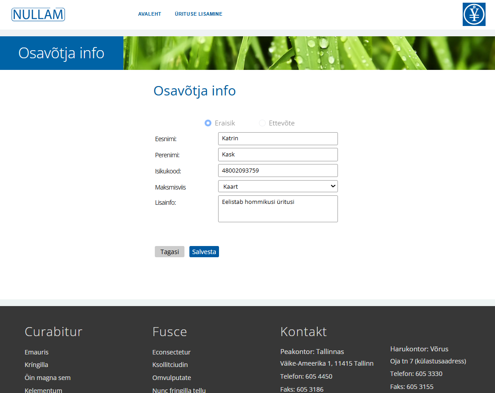

# Quick guide

1. [Clone the repository](#clone-the-repository)
2. [Start Attendify application using docker compose](#start-attendify-application-using-docker-compose)
3. [Start using Attendify application](#start-using-attendify-application)

<a id="clone-the-repository"></a>
### 1. Clone the repository


Run the following command:

 ```bash
git clone https://github.com/rutar/Attendify.git
cd Attendify
 ```
<a id="start-attendify-application-using-docker-compose"></a>
### 2. Start Attendify application using docker compose

Ensure Docker and Docker-compose are installed:

 ```bash
docker --version
docker-compose --version
 ```

Ensure gradle wrapper is available:
 ```bash
gradlew wrapper
 ```

Start the services defined in docker-compose.yml, ensuring to build images:
 ```bash
docker-compose up --build
 ```


Three container images will be built: **backend**, **frontend** and **db**.

Successful run of Attendify application will be shown in logs:


<a id="start-using-attendify-application"></a>
### 3. Start using Attendify application

 ```bash
http://localhost
 ```

Initial event list screen:


At the left part there are upcoming events, at the right part there are 
completed events from past.

Click on 'LISA ÜRITUS' or 'ÜRITUSE LISAMINE' routes to event detail page that shows participants of selected event:


Click on future event name routes to event detail page that shows participants of selected event:


Click on cross at the right of participant name removes corresponding participant from event:


Click on participant name routes to participant details page:




Click on 'add participant' button opens 'add participant' view:


After starting typing of firstname or lastname - existing participants registered 
in Attendify system will be suggested:


# Attendify – Technical Documentation

> **Version**: 1.0  
> **Author**: Ruslan Targonski  
> **Date**: May 2025

---
## Table of Contents

1. [Overview](#overview)
2. [Tech Stack](#tech-stack)
3. [Architecture](#architecture)
4. [Modules & Components](#modules--components)
5. [Domain Model](#domain-model)
6. [Database Schema](#database-schema)
7. [Triggers & Business Rules](#triggers--business-rules)
8. [Security Model](#security-model)(NOT IMPLEMENTED)
9. [REST API Endpoints](#rest-api-endpoints)
10. [Frontend (Angular 19)](#frontend-angular-19)
11. [Testing Strategy](#testing-strategy)
12. [Deployment](#deployment)
---

## Overview

Attendify is a web-based event registration platform supporting both individual (Person) and corporate (Company) participants. It provides:

- CRUD for events (future & past)
- Participant management (add/edit/delete, reuse across events)
- Automatic participant-count updates via DB triggers
- REST API for integration
- Responsive Angular SPA for user interaction

---

## Tech Stack

| Layer            | Technology                                     |
|------------------|------------------------------------------------|
| Backend          | Java 21, Spring Boot 3.x, Spring Data JPA     |
| Frontend         | Angular 19, TypeScript                         |
| Database         | PostgreSQL 15                                  |
| Migrations       | Liquibase                                      |
| Security         | Spring Security (JWT)                          |
| API Documentation| SpringDoc OpenAPI 3                            |
| Containerization | Docker, Docker Compose                         |
| Testing (Backend)| JUnit 5, Mockito, Spring Boot Test             |
| Testing (Frontend)| Karma + Jasmine, Playwright                    |

---

## Architecture

```
┌──────────────────────────┐
│      Angular 19 SPA      │
└───────────────▲──────────┘
                │ HTTP/JSON
┌───────────────┴──────────┐
│  Spring Boot Application │
│ ┌ Controllers            │
│ ├ Services               │
│ ├ Custom Mappers         │
│ └ Repositories (JPA)     │
└───────────────┬──────────┘
                │ JDBC
         ┌──────▼──────┐
         │ PostgreSQL  │
         └─────────────┘
```

- **Layered**: Controller → Service → Mapper → Repository
- **Custom Java mappers** (`EventMapper`, `ParticipantMapper`) map between entities and DTOs
- **Liquibase** changelogs for schema versioning

---

## Modules & Components

### Backend

- **Configuration**:
    - `CorsConfig.java`

- **Controllers**:
    - `EventController.java`
    - `ParticipantController.java`

- **Services**:
    - `EventService` / `EventServiceImpl`
    - `ParticipantService` / `ParticipantServiceImpl`
    - `EventParticipantService` / `EventParticipantServiceImpl`

- **Repositories**:
    - `EventRepository`
    - `ParticipantRepository`
    - `EventParticipantRepository`

- **Domain**:
    - `Event`, `Participant` (abstract)
    - `Person`, `Company` (extend `Participant`)
    - `EventParticipant`, `EventParticipantId`

- **DTOs**:
    - `EventDTO`
    - `ParticipantDTO`

- **Mappers** (custom implementations):
    - `EventMapper.java`
    - `ParticipantMapper.java`

- **Exceptions & Handlers**:
    - `ResourceNotFoundException`
    - `DuplicateResourceException`
    - `GlobalExceptionHandler`

### Frontend

- **Components**:
    - `event-list`, `event-create`, `event-detail`
    - `participant-create`, `participant-detail`
    - Layout: `header`, `footer`, banners, not-found

- **Services**:
    - `EventService`
    - `ParticipantService`
    - `ConfigService`

- **Models**:
    - `Event`, `ParticipantResponse`, `Participant`

- **Routing**:
    - Defined in `app.routes.ts`

- **E2E Tests**:
    - Playwright scripts for major flows

---

## Domain Model

```text
Event ──< EventParticipant >── Participant
                  │
      ┌───────────┴───────────┐
      ↓                       ↓
    Person                  Company
```

- **Event**: metadata + `totalParticipants`
- **Participant**: discriminator `PERSON` / `COMPANY`
- **Person**: name, personalCode, contact
- **Company**: companyName, registrationCode, participantCount

---

## Database Schema

Defined via Liquibase changelogs:

1. **events**
    - PK `id` (auto-increment from 99)
    - `name`, `date_time`, `location`, `status`, `additional_info`
    - `total_participants` (default 0)
    - audit timestamps

2. **participants**
    - PK `id` (sequence from 99)
    - `participant_type`, `payment_method`, `additional_info`
    - audit timestamps
    - check constraint on `participant_type`

3. **persons**
    - PK `id` → `participants(id)`
    - `first_name`, `last_name`, unique `personal_code`
    - `email`, `phone`

4. **companies**
    - PK `id` → `participants(id)`
    - `company_name`, unique `registration_code`
    - `participant_count` (> 0), `contact_person`, `email`, `phone`

5. **event_participant**
    - composite PK `(event_id, participant_id)`
    - FKs → `events(id)`, `participants(id)` (ON DELETE CASCADE)
    - `attendance_status`, `registered_at`

6. **Indexes**
    - `idx_events_date_time`
    - `idx_persons_personal_code`
    - `idx_companies_registration_code`

---

## Triggers & Business Rules

- **update_event_participants()**
    - Recalculates `events.total_participants` on `event_participant` changes
- **update_event_participants_on_company_change()**
    - Recalculates totals when `company.participant_count` is updated
- Triggers bound to INSERT/UPDATE/DELETE on `event_participant` and UPDATE OF `participant_count` on `companies`

---

## Security Model (NOT IMPLEMENTED)

- **Authentication**: JWT via Spring Security (NOT IMPLEMENTED)
- **Authorization**: Roles  (NOT IMPLEMENTED)
    - `ADMIN` — full access (NOT IMPLEMENTED)
    - `ORGANIZER` — manage events & participants (NOT IMPLEMENTED)
    - `VIEWER` — read-only (NOT IMPLEMENTED)

- **CORS**: configured to allow frontend origin

## REST API Endpoints

| Resource                                | Method | Description                       | Roles       |
|-----------------------------------------|--------|-----------------------------------|-------------|
| `/api/events`                           | GET    | List all events                   | VIEWER+     |
| `/api/events/{id}`                      | GET    | Get event details                 | VIEWER+     |
| `/api/events`                           | POST   | Create a new event                | ORGANIZER+  |
| `/api/events/{id}`                      | PUT    | Update event                      | ORGANIZER+  |
| `/api/events/{id}`                      | DELETE | Delete future event               | ORGANIZER+  |
| `/api/participants`                     | GET    | List all participants             | ORGANIZER+  |
| `/api/participants/{id}`                | GET    | Get participant details           | ORGANIZER+  |
| `/api/participants`                     | POST   | Create new participant            | ORGANIZER+  |
| `/api/events/{id}/participants/{pid}`   | POST   | Register participant to event     | ORGANIZER+  |
| `/api/events/{id}/participants/{pid}`   | DELETE | Unregister participant from event | ORGANIZER+  |

---

## Frontend (Angular 19)

- **Reactive Forms** with validation for `Event` and `Participant`
- **Angular Material** / custom SCSS for UI
- **Autocomplete** for existing persons/companies in participant form
- **Routing** defined in `app.routes.ts`
- **Components** covered by unit tests (Karma + Jasmine)

---

## Testing Strategy

- **Backend**
    - Unit tests: JUnit 5 + Mockito
- **Frontend**
    - Unit tests: Karma + Jasmine
    - End-to-end tests: Playwright

---

## Deployment

**Locally in IDE**

git clone https://github.com/rutar/Attendify.git
cd Attendify

- **Backend tests**
  cd /backend
  ./gradlew test

- **Frontend tests**
  cd /frontend
  ng test

- **E2E Playwright tests**
  cd /frontend/playwright
  npx playwright test --ui 

- Running locally  `application.yaml` and environment variables
should be adjusted according used PostgreSQL setup 

- **Run backend**
    cd /backend
    ./gradlew bootRun

- **Run frontend**
  cd /frontend
  ng serve


**Using Docker / Docker Desktop**

- **Docker Compose** (version 3.8)
    - `db` (Postgres 15)
    - `backend` (Spring Boot)
    - `frontend` (Angular build served via Nginx)

- **Build & Run**:
  ```bash
  
  
  docker-compose up --build
  ```  

  Application available at **http://localhost**


- **Configuration** via `application.yaml` and environment variables

---

- **Frontend**: Console logging for errors and HTTP failures

---
